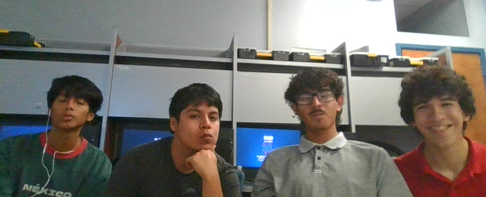
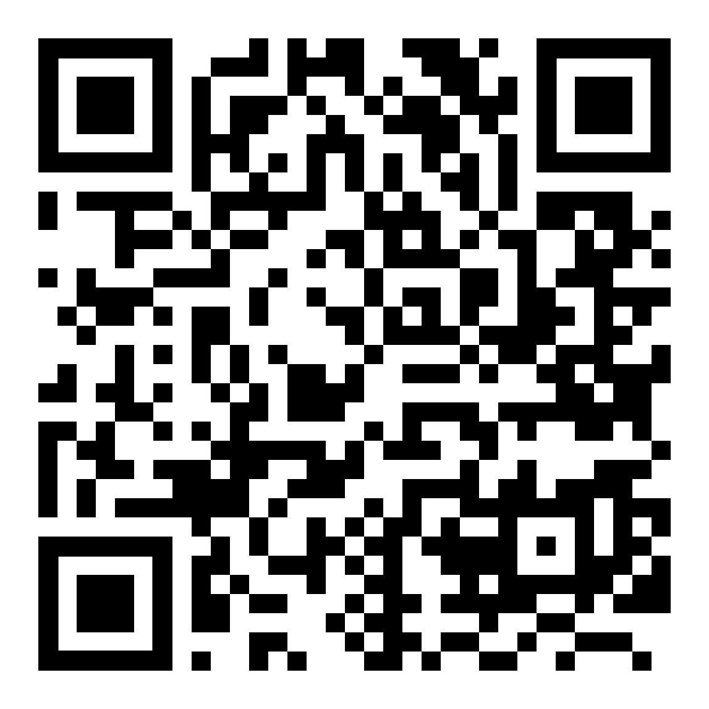

<!DOCTYPE html>
<html lang="en">
<head>
  <h1 style="text-align: center;">Energy Bites Dispenser</h1>

  <link rel="stylesheet" href="style.css">
</head>
<body>
  
  
  
  
Design by Miguel L, Alexander T, Emiliano C, and Carlos Z

  
Gladys Porter Early College High School

  
Ms. Cortez

  
  
  <h1 style="text-align: center;">Project Overview</h1>
  <h2 style="text-align: center;">Astronauts will spend 6–8 hours in their space suits while working on the Moon or Mars. Our project is to develop a Food Bite Dispenser inside the helmet that allows astronauts to get food bites, helping them stay energized during long activities.</h2>

</body>
</html>
